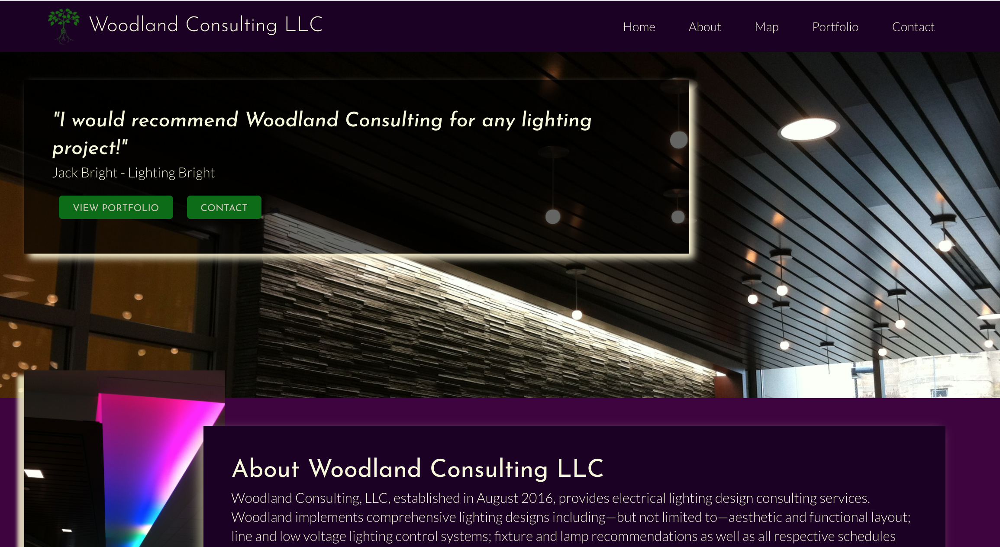
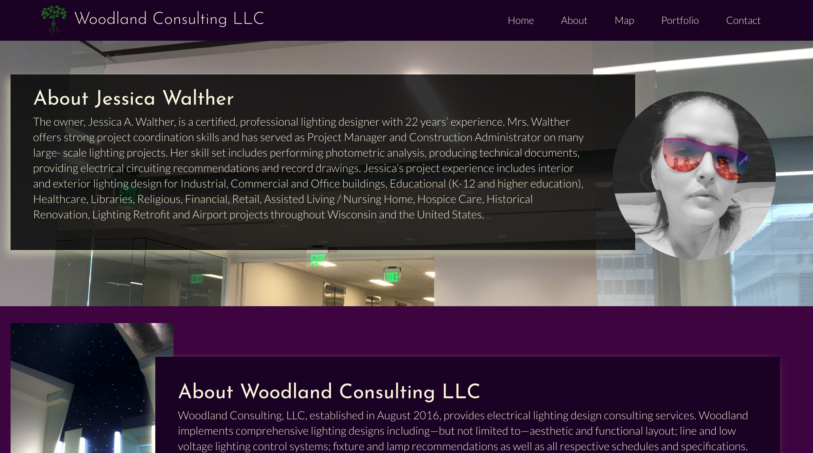
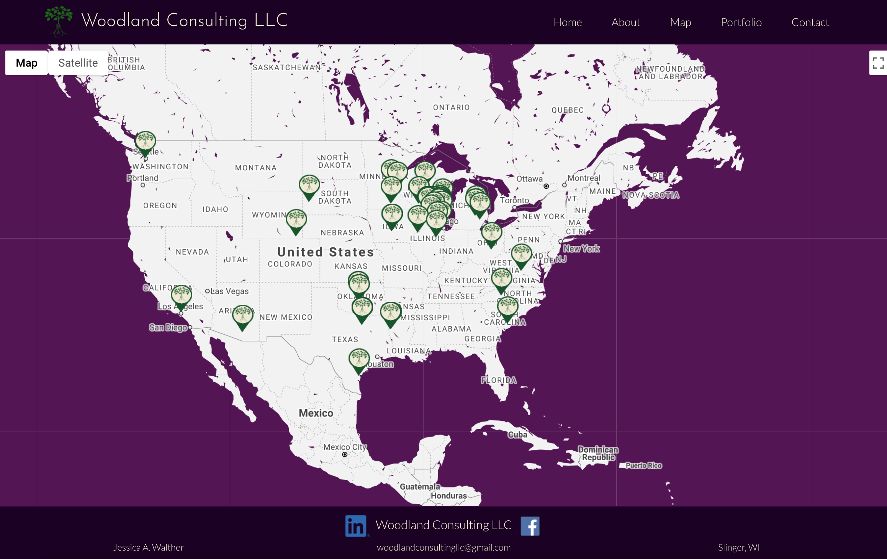
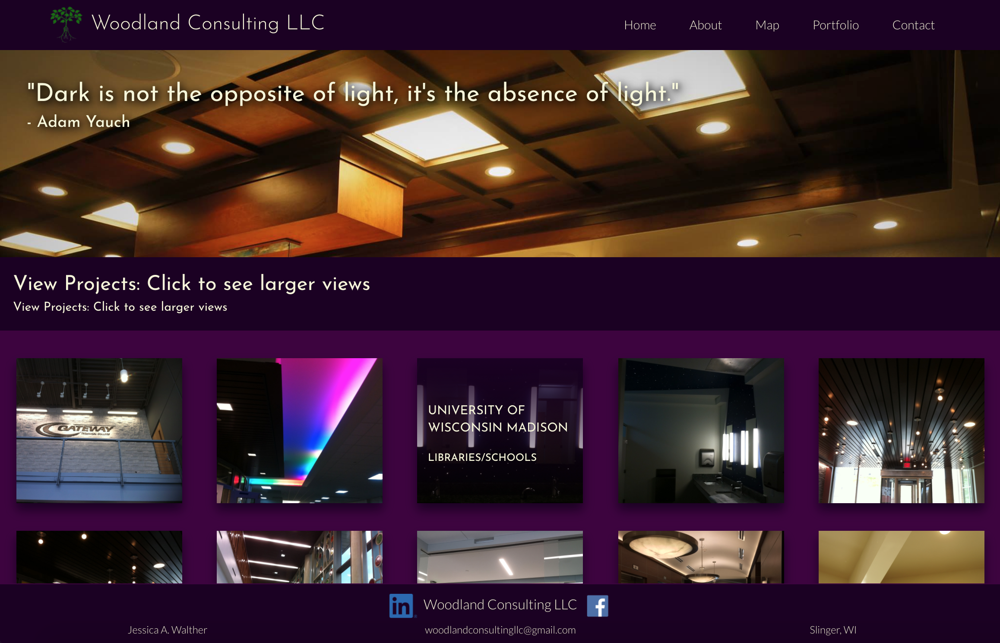
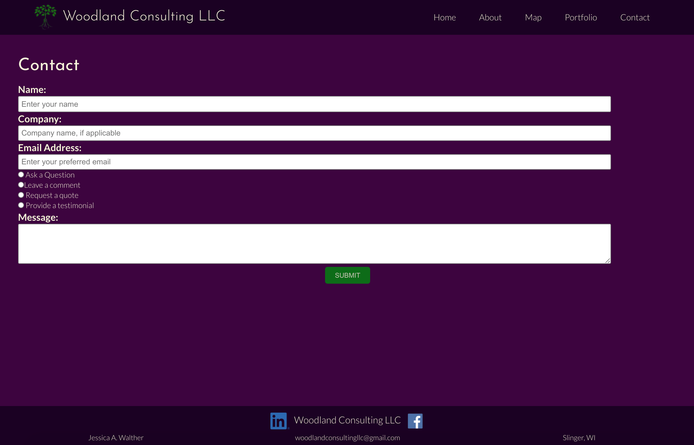
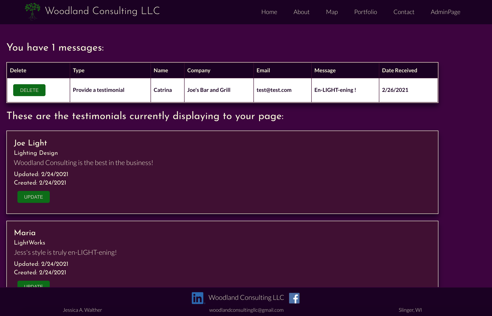

# Woodland Consulting LLC

 
 [View Live Site](https://woodland-consulting.herokuapp.com/)
 
 [Github](https://github.com/SMKrizan/WoodlandConsultingLLC)
 

## Description 

Our team were commissioned by WoodlandConsulting LLC to create an interactive website to increase web visibility and bring in new leads. We worked with the owner Jessica Walther to identify Woodland Consulting's needs and brand while researching her competitors to understand the lighting field and where we could add features to set her business apart. The final website features an intuitive and simple admin dashboard for retrieving messages and updating information on the site, while the client side display's her work with a focus on the breadth and depth of her experience. 

 

## Key Features
* HomePage Features: randomized testimonial chosen on the admin page, brief about section, links to key features on the site, contact form.
* About Features: sections about Jessica and Woodland Consulting.
* Maps Features: Google Map Interface showing WoodlandConsulting project locations with pop-up information on click about chosen projects.
* Works: Features quote, gallery with modals, and list of clients-by-project type.
* Contact: Features contact form with validation that displays on admin page upon submit.
* Admin Page: Password protected page that shows all submitted forms to the website, cards for updating homepage testimonials and personal contact information.  
* Other: 
Sensitive API key-protection,
JWT authentication,
PWA,
Queries and mutations for retrieving/adding/updating and deleting data,
Animations with React Spring

 

## Installation
Download files from this github repo. Instal React & additional node modules via npm install in root, server, and client folders.

 

## Live Site Stills

 

 

 

 

 

## Badges/Technologies

## License
We are operating with an MIT license, for more information [see the full language](https://choosealicense.com/licenses/mit)

 

## Contributing
  Please follow the standard Contributor Covenant when looking to make any additions to this project. The Standard Contributor Covenant can be found at [https://www.contributor-covenant.org/](https://www.contributor-covenant.org/)

 

## Creators

### Catherine Sibley
* email: catherine.lea.graham@gmail.com
* github: https://github.com/cgsdesign

### Maryna Pryadka
* email:  marynapryaka@gmail.com
* github: https://github.com/MarynaPR

### Joanna Grosshans
* email: joannagrosshans2@gmail.com
* github: https://github.com/jgrossh2

### Sara Krizan
* email: SMKrizan@gmail.com
* github: https://github.com/SMKrizan

## Questions
### Please contact us with any questions.